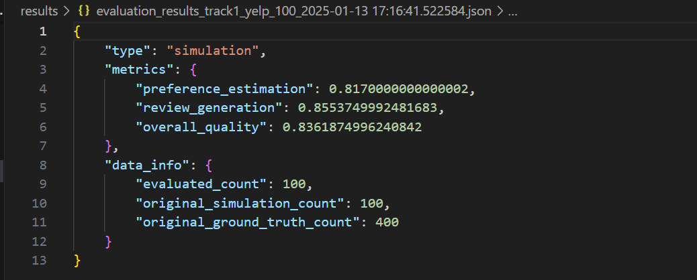
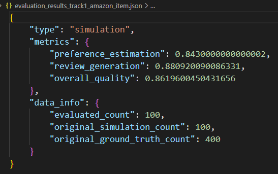
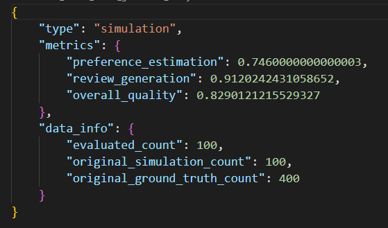

## Local test result 
### First 100 tasks for yelp 
1. baseline result

Baseline result.

2. version 1.0

For yelp: we generate user style and add it into prompt for generating reviews and stars.

3. version 2.0 

Based on version 1.0, we add reflection process to the class ReasoningBaseline.

4. version 3.0 (without reflection yet)

For Amazon: we analysis item information and add it into prompt.

For goodreads: we analysis item information and add it into prompt.

For yelp: add both item information and user style into prompt.
to do

