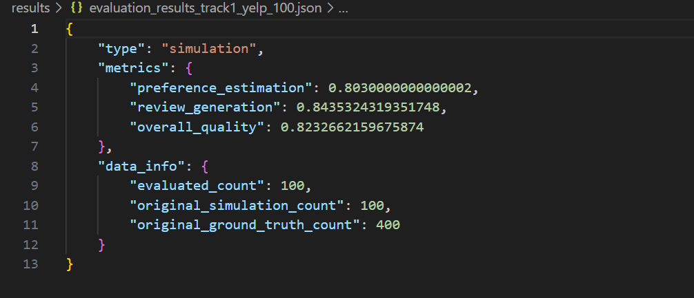
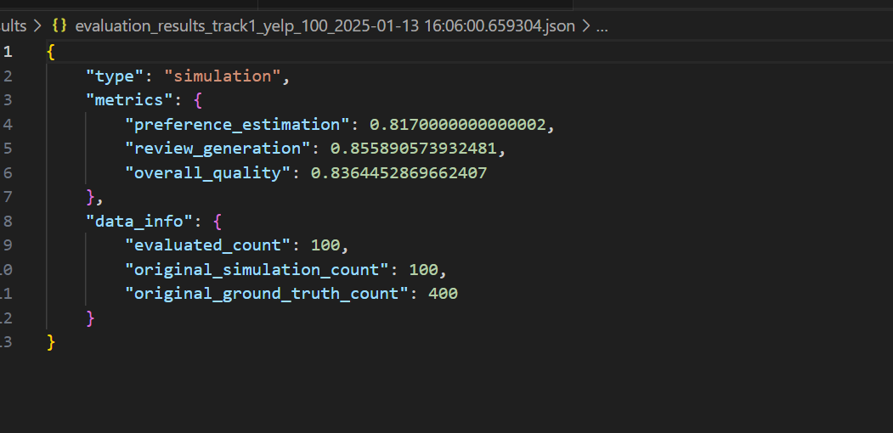

## Local test result 
### First 100 tasks for yelp 
1. baseline result

Baseline result.

2. version 1.0

We generate user style and add it into prompt for generating reviews and stars.

3. version 2.0

Based on version 1.0, we add reflection process to the class ReasoningBaseline.
