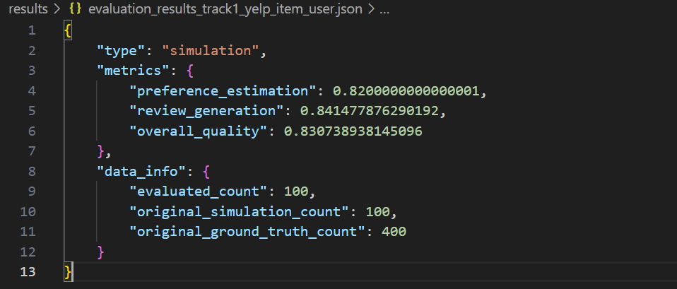
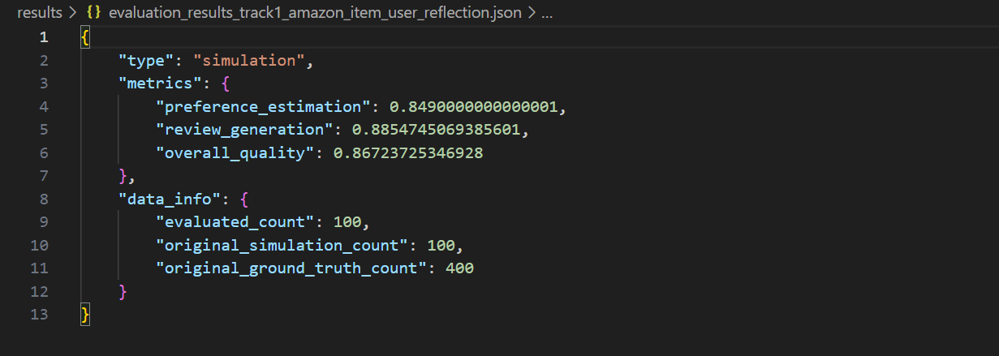
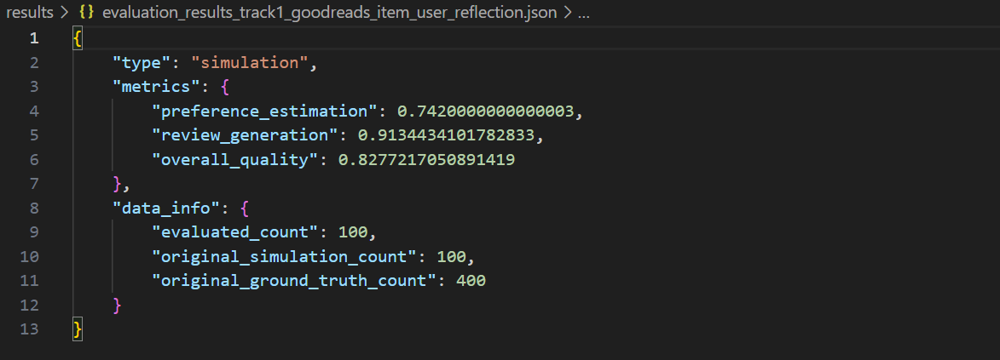
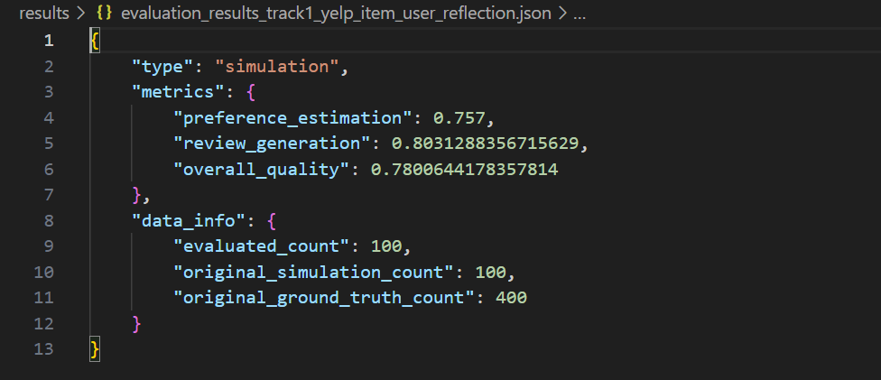

## Local test result 
### First 100 tasks for yelp 
1. baseline result

Baseline result.

2. version 1.0

For yelp: we generate user style and add it into prompt for generating reviews and stars.

3. version 2.0 

Based on version 1.0, we add reflection process to the class ReasoningBaseline.

4. version 3.0

For Amazon: we analysis item information and add it into prompt.

For goodreads: we analysis item information and add it into prompt.

For yelp: we analysis item information and add it into prompt.

4. version 4.0

For Amazon: Based on version 3.0, we add reflection to the reasoningbasline

For goodreads: Based on version 3.0, we add reflection to the reasoningbasline

For yelp: Based on version 3.0, we add reflection to the reasoningbasline, trying to debug

Compared with version 3.0, no obvious improvement.
